# LuxNote应用的介绍文档

## 〇、项目总体介绍

这是一个期中练手项目，实现了一款简单的笔记软件**LuxNote**，加入了一些定制的功能。

项目LOGO：


这款笔记应用在[fjnu-cse/NotePad: A new repo for Notepad](https://github.com/fjnu-cse/NotePad)的基础上进行开发，添加和完善的功能如下:

- 拓展基本功能👁️
  - 时间戳显示🕑
  - 笔记查询功能（按标题、按内容）🔍️
- 附加功能⭐️
  - 动态颜色主题自定义（UI美化）🎨
    - 配色选择
      - 选择主体颜色
      - 重置默认颜色
    - 明暗主题模式策略
  - 文件夹功能（笔记分类）📁 
    - 文件夹管理视图
      - 默认文件夹“未分类”
      - 文件夹创建
      - 文件夹搜索
      - 文件夹名称修改
      - 文件夹删除
    - 文件夹内部视图
      - 文件夹内部打开笔记
      - 文件夹内部笔记搜索
    - 笔记归类视图
      - 多选添加
      - 内置搜索

在“开始”之前，**特此说明**：由于本项目是制作完成后才进行的该项目说明，故你可以看到所有的展示画面都是应用“成品”图。这些完成图不影响制作过程的思路展示，且代码和效果展示都是最新版，不会出现不一致的情况。由于代码量较大，故大部分情况只展示关键代码，无关部分简单注释带过，这样既节省篇幅，也能突出重点。

## 一、初始应用的功能

初始应用是相同的，其功能效果，同示例项目[loginView/Android-NotePad-Project](https://github.com/loginView/Android-NotePad-Project)主页所展示，这里仅复制一下相关描述：

### 1.新建笔记和编辑笔记

(1)在主界面点击红色矩形所示按钮，新建笔记并进入编辑界面

[](https://github.com/loginView/Android-NotePad-Project/blob/master/运行结果截图/初始应用功能1.1.png)

(2)进入笔记编辑界面后，可进行笔记编辑

[](https://github.com/loginView/Android-NotePad-Project/blob/master/运行结果截图/初始应用功能1.2.png)

### 2.编辑标题

(1)在笔记编辑界面中点击菜单，显示的菜单条目中有“Edit title”

[](https://github.com/loginView/Android-NotePad-Project/blob/master/运行结果截图/初始应用功能2.1.png)

(2)点击“Edit title”，可编辑笔记标题

[](https://github.com/loginView/Android-NotePad-Project/blob/master/运行结果截图/初始应用功能2.2.png)

### 3.笔记列表

在进行笔记的新建和编辑后，在主界面中呈现笔记列表。在初始应用中背景颜色为黑色，字体颜色为白色，且笔记列表中的每个条目都只显示笔记标题

[](https://github.com/loginView/Android-NotePad-Project/blob/master/运行结果截图/初始应用功能3.png)

## 二、拓展基本功能

### （一）、笔记条目增加时间戳显示

#### 1. 功能要求

在主界面的笔记列表中，每个笔记条目除了显示标题外，还需要清晰地展示其最后修改时间。当笔记被创建或修改后，此时间戳应自动更新，并以用户友好的格式（例如 yyyy-MM-dd HH:mm）呈现。

#### 2. 实现思路和技术实现

为了实现时间戳的显示，我们遵循从数据存储、数据查询到UI绑定的完整流程。

(1) 数据库与数据层准备

- 数据表结构: 在 NotePadProvider 的 DatabaseHelper 中，notes 表已经包含了 COLUMN_NAME_MODIFICATION_DATE 字段，其类型为 INTEGER，用于存储自1970年以来的毫秒数 (System.currentTimeMillis())，这为精确的时间记录提供了数据基础。

- 数据持久化:

  - 在 NotePadProvider 的 insert() 方法中，为新创建的笔记自动添加当前的毫秒时间戳。
  - 在 NoteEditor 的 updateNote() 方法中，每当笔记内容或标题被更新时，都会将 COLUMN_NAME_MODIFICATION_DATE 字段更新为当前的毫秒时间戳。

  ```java
  // 在 NoteEditor.java 的 updateNote() 方法中
  ContentValues values = new ContentValues();
  // 关键：存入当前时间的毫秒数
  values.put(NotePad.Notes.COLUMN_NAME_MODIFICATION_DATE, System.currentTimeMillis());
  // ... 其他字段的 put 操作 ...
  getContentResolver().update(mUri, values, null, null);
  ```


(2) 布局文件修改 (noteslist_item.xml)

为了容纳新增的时间戳、后续的文件夹名称和字数统计，原有的 LinearLayout 布局被更为灵活的 RelativeLayout 替代。专门用于显示时间戳的 TextView 被添加进来，并赋予ID note_modification_date。

```xml
<RelativeLayout xmlns:android="http://schemas.android.com/apk/res/android"
    xmlns:tools="http://schemas.android.com/tools"
    android:layout_width="match_parent"
    android:layout_height="wrap_content"
    android:padding="16dp">

    <!-- 标题 -->
    <TextView
        android:id="@android:id/text1"
        ... />

    <!-- 修改时间 -->
    <TextView
        android:id="@+id/note_modification_date"
        android:layout_width="wrap_content"
        android:layout_height="wrap_content"
        android:layout_below="@android:id/text1"
        android:layout_alignParentStart="true"
        android:layout_marginTop="4dp"
        android:textAppearance="?android:attr/textAppearanceSmall"
        android:textColor="?attr/colorOnSurfaceVariant"
        tools:text="2025-12-06 10:30" />

    <!-- 其他 TextView... -->
</RelativeLayout>
```

(3) 数据查询 (NotesList.java)

为了从数据库中获取时间戳数据，在 NotesList Activity 中定义的 PROJECTION 数组被修改，加入了 COLUMN_NAME_MODIFICATION_DATE 字段。为了解决后续 JOIN 查询可能带来的列名歧义问题，所有列都使用了 AS 关键字定义了明确的别名。

```java
private static final String[] PROJECTION = new String[]{
        NotePad.Notes.TABLE_NAME + "." + NotePad.Notes._ID + " AS " + NotePad.Notes._ID, // 0
        NotePad.Notes.TABLE_NAME + "." + NotePad.Notes.COLUMN_NAME_TITLE + " AS " + NotePad.Notes.COLUMN_NAME_TITLE, // 1
        // 关键：加入修改日期字段的查询
        NotePad.Notes.TABLE_NAME + "." + NotePad.Notes.COLUMN_NAME_MODIFICATION_DATE + " AS " + NotePad.Notes.COLUMN_NAME_MODIFICATION_DATE, // 2
        NotePad.Notes.TABLE_NAME + "." + NotePad.Notes.COLUMN_NAME_NOTE + " AS " + NotePad.Notes.COLUMN_NAME_NOTE, // 3
        NotePad.Folders.TABLE_NAME + "." + NotePad.Folders.COLUMN_NAME_NAME + " AS folder_name" // 4
};
```

(4) UI 数据绑定 (自定义 NoteListCursorAdapter)

项目中使用了一个继承自 SimpleCursorAdapter 的自定义 Adapter NoteListCursorAdapter。在其 bindView 方法中，我们接管了所有字段的绑定逻辑。这允许我们对从数据库取出的原始毫秒数进行格式化处理。

```java
public static class NoteListCursorAdapter extends SimpleCursorAdapter {
    private final SimpleDateFormat sdf;
    // ...

    public NoteListCursorAdapter(Context context, int layout, Cursor c, String[] from, int[] to, int flags) {
        super(context, layout, c, from, to, flags);
        // 初始化日期格式化工具
        this.sdf = new SimpleDateFormat("yyyy-MM-dd HH:mm", Locale.getDefault());
        // ...
    }

    @Override
    public void bindView(View view, Context context, Cursor cursor) {
        // ...
        TextView timeTextView = view.findViewById(R.id.note_modification_date);

        // 关键：格式化时间戳
        // 1. 从Cursor获取毫秒数
        long millis = cursor.getLong(COLUMN_INDEX_MODIFICATION_DATE);
        // 2. 使用SimpleDateFormat格式化为字符串
        timeTextView.setText(sdf.format(new Date(millis)));
        // ...
    }
}
```


#### 3. 实现效果界面截图

(1) 笔记列表显示格式化的修改时间

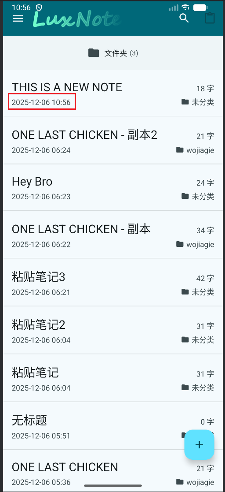

(2) 修改笔记并返回后，时间戳自动更新

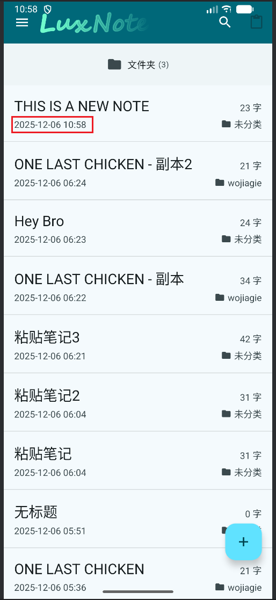

### （二）、笔记查询功能

#### 1. 功能要求

为用户提供一个便捷的笔记搜索功能。用户可以通过点击Toolbar上的搜索图标进入搜索模式。在搜索模式下，用户可以选择按笔记标题或按笔记内容进行模糊查询，并实时看到匹配的笔记列表和结果数量。

#### 2. 实现思路和技术实现

搜索功能的实现涉及UI动态变化、用户输入监听、后台异步查询和结果更新等多个环节。

(1) UI布局与动态切换 (notes_list.xml 和 NotesList.java)

- 布局设计: 在 notes_list.xml 的 MaterialToolbar 内部预置了一个 EditText（用于输入搜索词）、一个 RadioGroup（用于切换搜索范围）和一个 TextView（用于显示结果数量），这些组件初始时均被隐藏。

- 动态切换: 在 NotesList.java 中，通过 onOptionsItemSelected 监听搜索菜单项的点击。点击后，调用 enterSearchMode() 方法：

  - 使用 TransitionManager.beginDelayedTransition() 实现平滑的布局动画。
  - 隐藏应用Logo，显示“关闭”图标作为返回按钮。
  - 通过 invalidateOptionsMenu() 隐藏其他菜单项。
  - 动态显示并激活搜索框 EditText，并自动弹出软键盘以提升用户体验。
  - 显示用于切换搜索范围的 RadioGroup。

  ```xml
  <com.google.android.material.appbar.MaterialToolbar ...>
      <!-- 应用Logo，搜索时隐藏 -->
      <ImageView
          android:id="@+id/toolbar_logo"
          ... />
      <!-- 搜索框，初始不可见 -->
      <EditText
          android:id="@+id/search_edit_text"
          android:visibility="invisible"
          ... />
  </com.google.android.material.appbar.MaterialToolbar>
  
  <!-- 搜索选项，初始隐藏 -->
  <LinearLayout
      android:id="@+id/search_options_container"
      android:visibility="gone"
      ...>
      <RadioGroup ...>
          <RadioButton
              android:id="@+id/radio_search_title"
              android:text="@string/search_by_title" />
          <RadioButton
              android:id="@+id/radio_search_content"
              android:text="@string/search_by_content" />
      </RadioGroup>
  </LinearLayout>
  ```

(2) 用户输入监听与防抖 (NotesList.java)

为了避免用户每输入一个字符就触发一次数据库查询，采用了**防抖**策略。

- 为搜索框 EditText 添加 TextWatcher 监听器。
- 在 afterTextChanged 回调中，利用 Handler.postDelayed() 将实际的搜索操作延迟300-500毫秒执行。如果在延迟时间内用户有新的输入，前一个未执行的搜索任务会被移除，从而有效减少了数据库访问次数。

```java
private void setupSearch() {
    mSearchEditText.addTextChangedListener(new TextWatcher() {
        private final Handler handler = new Handler();
        private Runnable workRunnable;

        @Override
        public void afterTextChanged(Editable s) {
            // 防抖动：延迟500毫秒执行搜索
            handler.removeCallbacks(workRunnable);
            workRunnable = () -> performSearch(s.toString());
            handler.postDelayed(workRunnable, 500);
        }
        // ...
    });
}
```

(3) 异步查询与数据更新 (使用LoaderManager和CursorLoader)

搜索的核心是利用 LoaderManager 框架进行异步数据查询，<u>避免阻塞UI线程</u>。

- performSearch() 方法是搜索的入口。它会创建一个 Bundle，将搜索关键词和搜索类型（title 或 note，由 RadioGroup 的选中状态决定）存入其中，然后调用 LoaderManager.getInstance(this).restartLoader(...) 来触发一次新的查询
- onCreateLoader() 方法根据传入的 Bundle 动态构建 CursorLoader。它会生成SQL的 WHERE 子句（如 title LIKE ?）和对应的查询参数 selectionArgs（如 {"%关键词%"}）。
- onLoadFinished() 方法在查询完成后被回调。它通过 mAdapter.swapCursor(data) 将新的 Cursor（即搜索结果）更新到 Adapter，从而刷新列表。同时，它也会根据 data.getCount() 更新搜索结果数量的 TextView。

```java
@NonNull
@Override
public Loader<Cursor> onCreateLoader(int id, @Nullable Bundle args) {
    // ...
    String selection = null;
    String[] selectionArgs = null;

    if (args != new null && args.containsKey("query")) {
        String query = args.getString("query");
        String searchType = args.getString("search_type"); // "title" or "note"

        if (query != null && !query.isEmpty() && searchType != null) {
            selection = searchType + " LIKE ?";
            selectionArgs = new String[]{"%" + query + "%"};
        }
    }

    return new CursorLoader(
            this,
            queryUri,
            PROJECTION,
            selection, // 动态生成的 selection
            selectionArgs, // 动态生成的 selectionArgs
            NotePad.Notes.DEFAULT_SORT_ORDER
    );
}
```

#### 3. 实现效果界面截图

(1) 点击Toolbar搜索图标，进入搜索模式

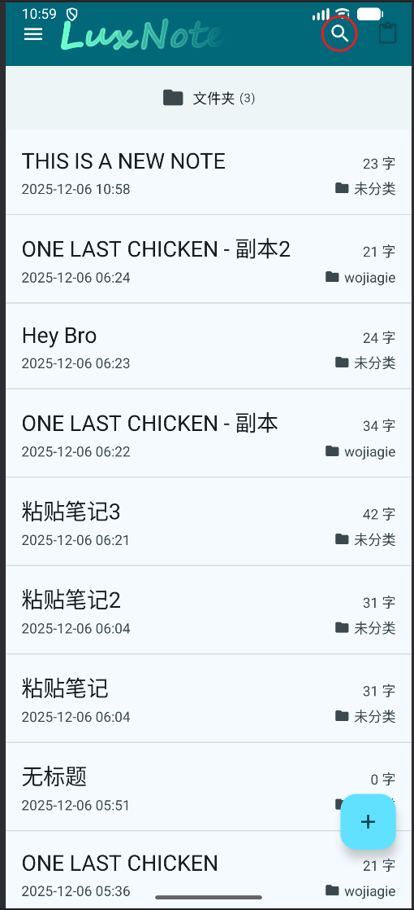

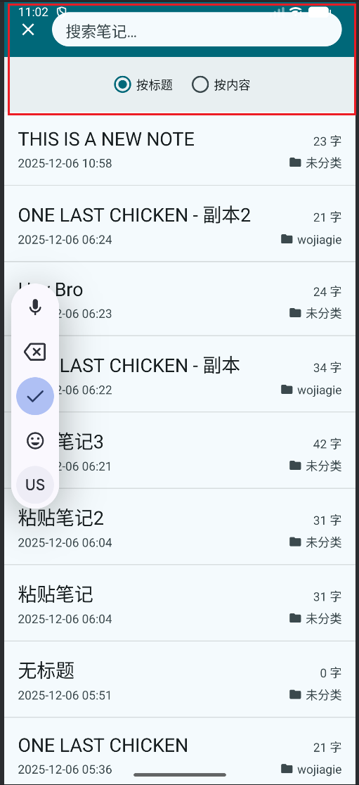

(2) 按标题进行搜索，实时显示结果和数量

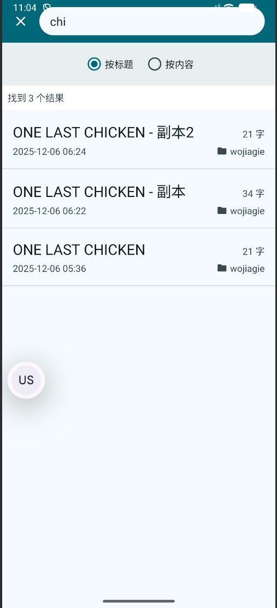

(3) 切换为按内容进行搜索

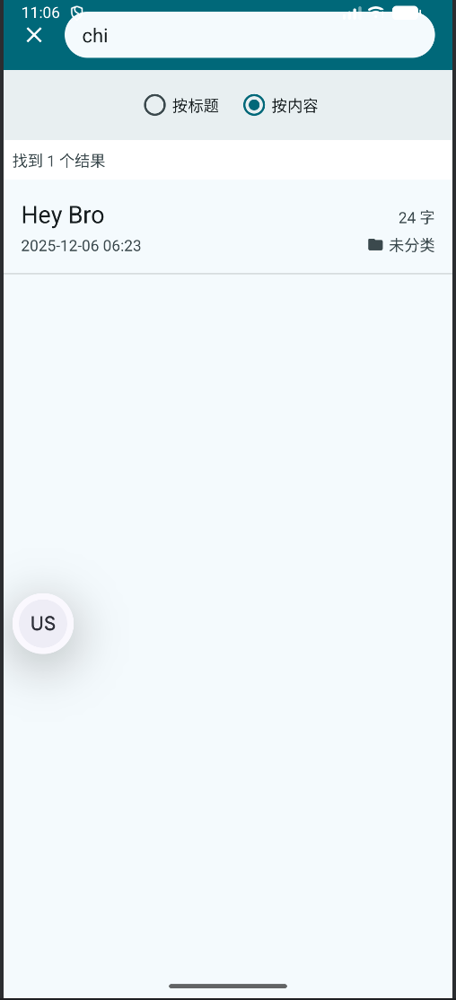

(4) 清空搜索框或退出搜索模式，恢复完整笔记列表

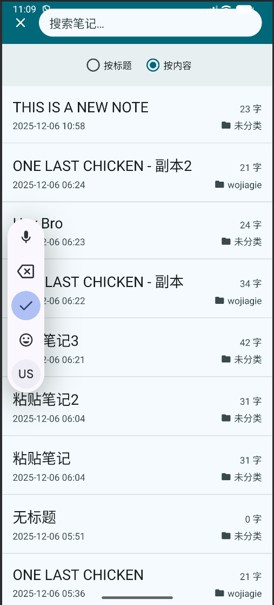

## 三、拓展附加功能

### （一）、动态颜色主题自定义（UI美化）

#### 1. 功能要求

为了提升应用的个性化体验和视觉舒适度，本项目引入了主题自定义功能。用户可以进入设置页面，自由选择应用的主体配色，仅需一个主体配色，就能动态生成一系列的 Material3 风格的颜色；并根据个人偏好或环境光线设置应用的明暗（Light/Dark）模式策略。

#### 2. 实现思路和技术实现

该功能的实现主要依赖于 androidx.preference 框架、Material Design 3 的动态颜色（Material You）以及 Android 的主题切换机制。

(1) 设置界面的构建

- 框架与导航: 使用一个 SettingsActivity 作为容器，内部加载 PreferenceFragmentCompat。res/xml/root_preferences.xml 定义了设置的主界面，其中“主题”选项通过 app:fragment 属性，导航至一个专门负责主题设置的 ThemeSettingsFragment，该 Fragment 加载 res/xml/theme_preferences.xml 布局。
- Preference 文件: theme_preferences.xml 文件是主题设置的核心UI定义，它包含了两个主要设置项：
- 一个自定义的 ColorPickerPreference 用于选择主体颜色。
- 一个标准的 ListPreference 用于选择明暗模式。

以下是这一步的相关代码，关键处用注释作了说明。

```java
public class SettingsActivity extends BaseActivity implements PreferenceFragmentCompat.OnPreferenceStartFragmentCallback {
    private static final String KEY_THEME_CHANGED = "theme_changed";
    private boolean themeChanged = false; // 标记主题是否更改，用于决定返回时是否重启主Activity

    @Override
    protected void onCreate(Bundle savedInstanceState) {
        super.onCreate(savedInstanceState);
        if (savedInstanceState != null) {
            themeChanged = savedInstanceState.getBoolean(KEY_THEME_CHANGED, false);
        }
        setContentView(R.layout.activity_settings);

        Toolbar toolbar = findViewById(R.id.toolbar_settings);
        setSupportActionBar(toolbar);

        // 显示返回按钮
        if (getSupportActionBar() != null) {
            getSupportActionBar().setDisplayHomeAsUpEnabled(true);
        }

        if (savedInstanceState == null) {
            // 首次创建时加载根设置Fragment
            getSupportFragmentManager()
                .beginTransaction()
                .replace(R.id.settings_container, new SettingsFragment())
                .commit();
        }

        // 处理返回按钮的逻辑，如果主题改变则重启NotesList
        getOnBackPressedDispatcher().addCallback(this, new OnBackPressedCallback(true) {
            @Override
            public void handleOnBackPressed() {
                navigateBack();
            }
        });
    }

    @Override
    protected void onSaveInstanceState(@NonNull Bundle outState) {
        super.onSaveInstanceState(outState);
        outState.putBoolean(KEY_THEME_CHANGED, themeChanged);
    }

    // 供 PreferenceFragment 调用，通知主题已更改
    public void onThemeChanged() {
        themeChanged = true;
    }

    // 返回导航逻辑
    private void navigateBack() {
        if (themeChanged) {
            // 如果主题已更改，重启主界面以应用主题
            Intent intent = new Intent(this, NotesList.class);
            // 清除所有旧的 Activity 栈，并创建一个新的任务栈
            intent.addFlags(Intent.FLAG_ACTIVITY_NEW_TASK | Intent.FLAG_ACTIVITY_CLEAR_TASK);
            startActivity(intent);
            finish();
        } else {
            // 如果主题未更改，正常结束当前 Activity
            finish();
        }
    }

    // 处理Toolbar上返回按钮的点击事件
    @Override
    public boolean onOptionsItemSelected(MenuItem item) {
        if (item.getItemId() == android.R.id.home) {
            navigateBack();
            return true;
        }
        return super.onOptionsItemSelected(item);
    }

    // 自定义Activity退出动画，如果主题改变则不播放退出动画，因为会重启主Activity
    @Override
    public void finish() {
        super.finish();
        if (!themeChanged) {
            overridePendingTransition(R.anim.stay, R.anim.slide_out_left);
        }
    }

    // PreferenceFragmentCompat.OnPreferenceStartFragmentCallback 实现
    // 用于处理Preference点击跳转到另一个Fragment的逻辑
    @Override
    public boolean onPreferenceStartFragment(@NonNull PreferenceFragmentCompat caller, @NonNull Preference pref) {
        final Bundle args = pref.getExtras();
        final String fragmentClass = pref.getFragment(); // 获取在 Preference 中定义的 Fragment 类名

        if (fragmentClass == null) {
            return false;
        }

        final Fragment fragment = getSupportFragmentManager().getFragmentFactory().instantiate(
            getClassLoader(),
            fragmentClass
        );
        fragment.setArguments(args);
        fragment.setTargetFragment(caller, 0);

        // 替换当前的 Fragment，并加入回退栈
        getSupportFragmentManager().beginTransaction()
            .replace(R.id.settings_container, fragment)
            .addToBackStack(null)
            .commit();

        return true;
    }
}

```

```xml
<!-- activity_settings.xml -->
<?xml version="1.0" encoding="utf-8"?>
<LinearLayout xmlns:android="http://schemas.android.com/apk/res/android"
        xmlns:app="http://schemas.android.com/apk/res-auto"
        xmlns:tools="http://schemas.android.com/tools"
        android:layout_width="match_parent"
        android:layout_height="match_parent"
        android:orientation="vertical"
        tools:context=".SettingsActivity">

        <com.google.android.material.appbar.MaterialToolbar
            android:id="@+id/toolbar_settings"
            android:layout_width="match_parent"
            android:layout_height="?attr/actionBarSize"
            android:background="?attr/colorSurface"
            app:title="@string/menu_settings"
            app:navigationIcon="?attr/homeAsUpIndicator" /> <!-- 使用系统默认返回箭头图标 -->

        <FrameLayout
            android:id="@+id/settings_container"
            android:layout_width="match_parent"
            android:layout_height="match_parent" />

</LinearLayout>
    
```

```xml
<!-- root_preferences.xml -->
<?xml version="1.0" encoding="utf-8"?>
<androidx.preference.PreferenceScreen xmlns:app="http://schemas.android.com/apk/res-auto"
        xmlns:android="http://schemas.android.com/apk/res/android">
        <!-- 使用 PreferenceCategory 来给设置项分组 -->
        <PreferenceCategory app:title="外观">

            <!-- 这是一个 Preference，代表一个设置项 -->
            <!-- 点击它将会导航到另一个 PreferenceScreen (二级页面)，通过 app:fragment 指定目标Fragment类名 -->
            <Preference
                app:key="theme"
                app:title="主题"
                app:summary="选择应用的主题颜色和明暗模式"
                app:icon="@drawable/ic_palette"
                app:fragment="com.example.android.notepad.ThemeSettingsFragment"> <!-- 关键：指定跳转到的Fragment -->
            </Preference>

        </PreferenceCategory>

        <!-- 未来可以添加更多分组和设置项 -->
        <!-- ... -->
</androidx.preference.PreferenceScreen>
    
```

```xml
<!-- theme_preferences.xml -->
<?xml version="1.0" encoding="utf-8"?>
<androidx.preference.PreferenceScreen xmlns:android="http://schemas.android.com/apk/res/android"
        xmlns:app="http://schemas.android.com/apk/res-auto">
        <PreferenceCategory app:title="配色选择">
            <com.example.android.notepad.ColorPickerPreference
                android:key="custom_theme_color"
                android:title="主体配色"
                android:layout="@layout/preference_color_picker" /> <!-- 关键：自定义Preference的布局 -->
        </PreferenceCategory>
        <PreferenceCategory app:title="@string/theme_dark_mode_strategy_title">
            <ListPreference
                app:key="@string/theme_dark_mode_strategy_key"
                app:title="@string/theme_dark_mode_strategy_title"
                app:summary="%s"
                app:entries="@array/dark_mode_entries"
                app:entryValues="@array/dark_mode_values"
                app:defaultValue="system"
                app:useSimpleSummaryProvider="true" />
        </PreferenceCategory>
</androidx.preference.PreferenceScreen>
    
```

```java
public class SettingsFragment extends PreferenceFragmentCompat {
    @Override
    public void onCreatePreferences(@Nullable Bundle savedInstanceState, @Nullable String rootKey) {
        setPreferencesFromResource(R.xml.root_preferences, rootKey);
        // 确保 "theme" preference 能够正确跳转到 ThemeSettingsFragment
        Preference themePreference = findPreference("theme");
        if (themePreference != null) {
            themePreference.setFragment("com.example.android.notepad.ThemeSettingsFragment");
        }
    }
}
    
```

```java
public class ThemeSettingsFragment extends PreferenceFragmentCompat {
    private SharedPreferences sharedPreferences;
    private ColorPickerPreference colorPickerPreference;
    @Override
    public void onCreatePreferences(@Nullable Bundle savedInstanceState, @Nullable String rootKey) {
        setPreferencesFromResource(R.xml.theme_preferences, rootKey);
        sharedPreferences = PreferenceManager.getDefaultSharedPreferences(requireContext());
        // 1. 处理“明暗策略”
        setupDarkModePreference();
        // 2. 处理“主体配色”
        setupColorPickerPreference();
    }

    private void setupDarkModePreference() {
        ListPreference darkModePreference = findPreference(getString(R.string.theme_dark_mode_strategy_key));
        if (darkModePreference != null) {
            darkModePreference.setOnPreferenceChangeListener((preference, newValue) -> {
                ((SettingsActivity) requireActivity()).onThemeChanged();
                ThemeUtil.applyDarkMode((String) newValue);
                return true; // 返回 true 表示接受这个新值，系统会自动保存它
            });
        }
    }

    private void setupColorPickerPreference() {
        colorPickerPreference = findPreference("custom_theme_color");
        if (colorPickerPreference != null) {
            // 当 Fragment 视图创建好后，更新颜色预览
            colorPickerPreference.setOnPreferenceClickListener(preference -> {
                showColorPickerDialog();
                return true;
            });

            colorPickerPreference.setOnResetClickListener(() -> {
                // 当重置按钮被点击时，ColorPickerPreference 内部已经
                // 处理了颜色值的重置和保存。只需要重启 Activity 来应用主题。
                ((SettingsActivity) requireActivity()).onThemeChanged();
                requireActivity().recreate();
            });

            int defaultColor = ContextCompat.getColor(requireContext(), R.color.default_seed_color);
            int savedColor = sharedPreferences.getInt("custom_theme_color", defaultColor);
            colorPickerPreference.setCurrentColor(savedColor);
        }
    }

    private void showColorPickerDialog() {
        int defaultColor = colorPickerPreference.getCurrentColor();

        new ColorPickerDialog
                .Builder(requireContext())
                .setTitle("选择主体颜色")
                .setColorShape(ColorShape.SQAURE) // Or CIRCLE
                .setDefaultColor(defaultColor)
                .setColorListener((color, colorHex) -> {
                    ((SettingsActivity) requireActivity()).onThemeChanged();
                    // 1. 更新自定义的Preference，它内部会保存到SharedPreferences并更新UI
                    colorPickerPreference.setCurrentColor(color);
                    // 2. 为了让整个应用的主题色生效，需要重启 Activity
                    requireActivity().recreate();
                })
                .show();
    }

}
```

更新 AndroidManifest.xml：

```xml
<?xml version="1.0" encoding="utf-8"?>
<manifest xmlns:android="http://schemas.android.com/apk/res/android"
    package="com.example.android.notepad">

    <application
        android:name=".NotePadApplication"
        android:allowBackup="true"
        android:icon="@mipmap/ic_launcher"
        android:label="@string/app_name"
        android:theme="@style/AppTheme"> <!-- Application主题是BaseActivity的主题 -->
        <!-- ... 其他Activity ... -->
        <activity
            android:name=".SettingsActivity"
            android:exported="false"
            android:label="@string/menu_settings" /> <!-- 注册SettingsActivity -->
        <!-- ... -->
    </application>
</manifest>
```

(2) 明暗主题模式策略

- UI与存储: ListPreference 提供了“跟随系统”、“亮色模式”、“深色模式”三个选项，其选项文本和对应的值分别定义在 strings.xml 中。当用户做出选择后，androidx.preference 框架会自动将所选的值（如 "system", "light", "dark"）保存到应用的 SharedPreferences 中。
- 主题应用:
  - 在自定义的 NotePadApplication 类的 onCreate() 方法中，应用启动时会读取 SharedPreferences 中的明暗模式设置。
  - 根据读取到的值，调用 AppCompatDelegate.setDefaultNightMode() 方法来应用全局的明暗主题。这确保了应用在下次启动时能保持用户所选的模式。

```java
public class NotePadApplication extends Application {
    @Override
    public void onCreate() {
        super.onCreate();
        SharedPreferences sharedPreferences = PreferenceManager.getDefaultSharedPreferences(this);
        // 读取明暗模式策略偏好
        String darkModeValue = sharedPreferences.getString(
                getString(R.string.theme_dark_mode_strategy_key),
                "system" // 默认值
        );
        // 应用偏好
        ThemeUtil.applyDarkMode(darkModeValue);
    }
}
```

```java
public class ThemeUtil {
    public static void applyDarkMode(String darkModeValue) {
        switch (darkModeValue) {
            case "light":
                AppCompatDelegate.setDefaultNightMode(AppCompatDelegate.MODE_NIGHT_NO);
                break;
            case "dark":
                AppCompatDelegate.setDefaultNightMode(AppCompatDelegate.MODE_NIGHT_YES);
                break;
            default: // "system"
            			AppCompatDelegate.setDefaultNightMode(AppCompatDelegate.MODE_NIGHT_FOLLOW_SYSTEM);
                break;
        }
    }
}
```

添加 strings.xml 相关条目：

```xml
<string name="theme_dark_mode_strategy_title">明暗策略</string>
<string name="theme_dark_mode_strategy_key">dark_mode_strategy</string>
<string-array name="dark_mode_entries">
    <item>跟随系统</item>
    <item>明色模式</item>
    <item>暗色模式</item>
</string-array>
<string-array name="dark_mode_values">
    <item>system</item>
    <item>light</item>
    <item>dark</item>
</string-array>
```

(3) 配色选择与动态颜色

- 自定义 Preference: 创建了一个 ColorPickerPreference 类，它继承自 Preference。其布局 (preference_color_picker.xml) 包含了一个颜色预览圆圈和一个重置按钮。
- 第三方库集成: 点击该 Preference 会调用第三方颜色选择库 <u>com.github.dhaval2404:colorpicker</u>，弹出一个美观的颜色选择对话框。
- 颜色存储与重置: 用户选择的颜色值（一个整数）被保存到 SharedPreferences 中。点击重置按钮则会从 SharedPreferences 中移除该颜色值。
- 动态颜色应用:
  - 所有 Activity 继承自一个 BaseActivity。在 BaseActivity 的 onCreate() 方法中，应用会尝试从 SharedPreferences 读取用户保存的颜色值。
  - 如果存在自定义颜色，则调用 Material 3 的 DynamicColors.applyToActivityIfAvailable()（或类似的动态主题API），将这个颜色作为“种子颜色”（Seed Color）。系统会基于这个种子颜色自动生成一套完整的、和谐的 Material You 调色板（包括 colorPrimary, colorSurface, colorPrimaryContainer 等），并应用到当前 Activity。
  - 如果不存在自定义颜色（用户点击了重置或从未设置），应用则会回退到默认的主题颜色。
- 主题实时刷新: 当用户在 SettingsActivity 中更改了主题（颜色或明暗模式）后，SettingsActivity 会设置一个 themeChanged 标志位。当用户返回 NotesList 时，SettingsActivity 会通过 Intent.FLAG_ACTIVITY_NEW_TASK | Intent.FLAG_ACTIVITY_CLEAR_TASK 标志重启主界面，以确保新的主题能够被完整、无误地应用。

```java
public class ColorPickerPreference extends Preference {
    public interface OnResetClickListener {
        void onResetClick();
    }
    private OnResetClickListener resetClickListener;
    private MaterialCardView colorPreview;
    private ImageButton resetButton;
    private int currentColor = Color.BLUE; // 默认颜色，或者从SharedPreferences加载

    // 构造函数链，确保 setLayoutResource 被调用
    public ColorPickerPreference(@NonNull Context context, @Nullable AttributeSet attrs, int defStyleAttr, int defStyleRes) {
        super(context, attrs, defStyleAttr, defStyleRes);
        setLayoutResource(R.layout.preference_color_picker); // 指定自定义布局
    }

    public ColorPickerPreference(@NonNull Context context, @Nullable AttributeSet attrs, int defStyleAttr) {
        this(context, attrs, defStyleAttr, 0);
    }

    public ColorPickerPreference(@NonNull Context context, @Nullable AttributeSet attrs) {
        this(context, attrs, 0);
    }

    public ColorPickerPreference(@NonNull Context context) {
        this(context, null);
    }

    // 当Preference的View被创建或重新绑定时调用
    @Override
    public void onBindViewHolder(@NonNull PreferenceViewHolder holder) {
        super.onBindViewHolder(holder);
        colorPreview = (MaterialCardView) holder.findViewById(R.id.color_preview);
        resetButton = (ImageButton) holder.findViewById(R.id.reset_color_button);
        updateColorPreview(); // 更新颜色预览块的颜色
        resetButton.setOnClickListener(v -> {
            // 1. 获取应用主题中定义的默认颜色
            int defaultColor = ContextCompat.getColor(getContext(), R.color.default_seed_color);

            // 2. 更新当前颜色状态并保存
            setCurrentColor(defaultColor);

            // 3. 通知 Fragment (如果监听器被设置了)
            if (resetClickListener != null) {
                resetClickListener.onResetClick();
            }
        });
    }

    public void setOnResetClickListener(OnResetClickListener listener) {
        this.resetClickListener = listener;
    }

    // 设置当前颜色，并保存到SharedPreferences
    public void setCurrentColor(int color) {
        if (currentColor != color) {
            currentColor = color;
            persistInt(color); // Preference自带的方法，自动保存到SharedPreferences
            updateColorPreview(); // 更新UI
        }
    }

    // 获取当前保存的颜色
    public int getCurrentColor() {
        // 从SharedPreferences中获取颜色，如果没有则使用currentColor的当前值（通常是初始默认值）
        return getPersistedInt(currentColor);
    }

    // 实际更新UI上颜色预览块的方法
    private void updateColorPreview() {
        if (colorPreview != null) {
            colorPreview.setCardBackgroundColor(currentColor);
        }
    }

    // 覆盖这个方法来在Preference加载时设置初始值
    @Override
    protected void onSetInitialValue(Object defaultValue) {
        // Preference会根据XML中的android:defaultValue属性传递过来
        // 或者如果没有指定，则传递null。这里确保传入的是一个int
        if (defaultValue == null) {
            setCurrentColor(getPersistedInt(Color.BLUE)); // 如果没有默认值，使用蓝色
        } else {
            setCurrentColor(getPersistedInt((int) defaultValue));
        }
    }
}
```

#### 3. 实现效果界面截图

(1) 设置界面入口


(2) 主题设置界面（颜色选择与明暗模式）


(3) 使用颜色选择器自定义主体颜色 

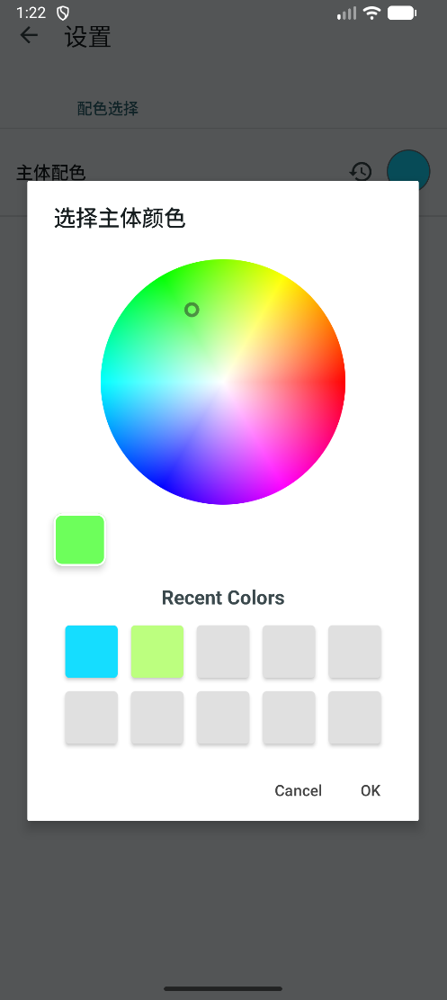


(4) 应用了新的自定义颜色主题的笔记列表和编辑器界面

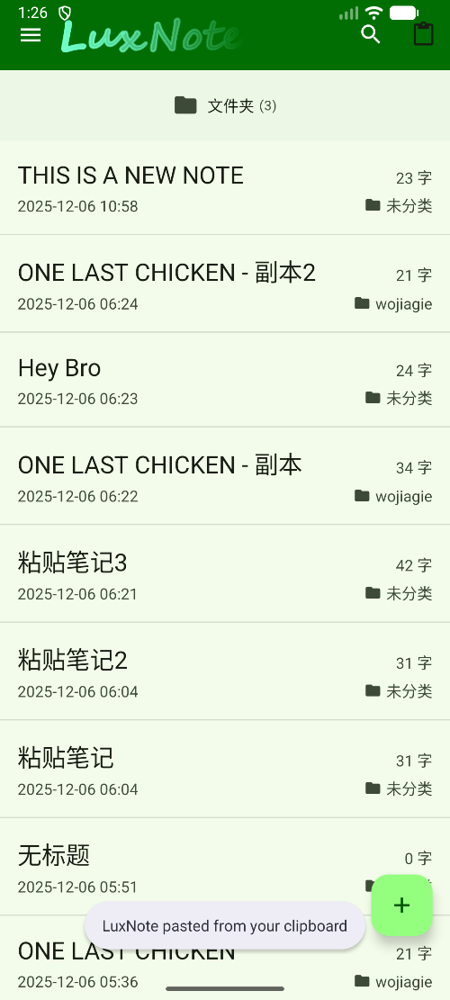

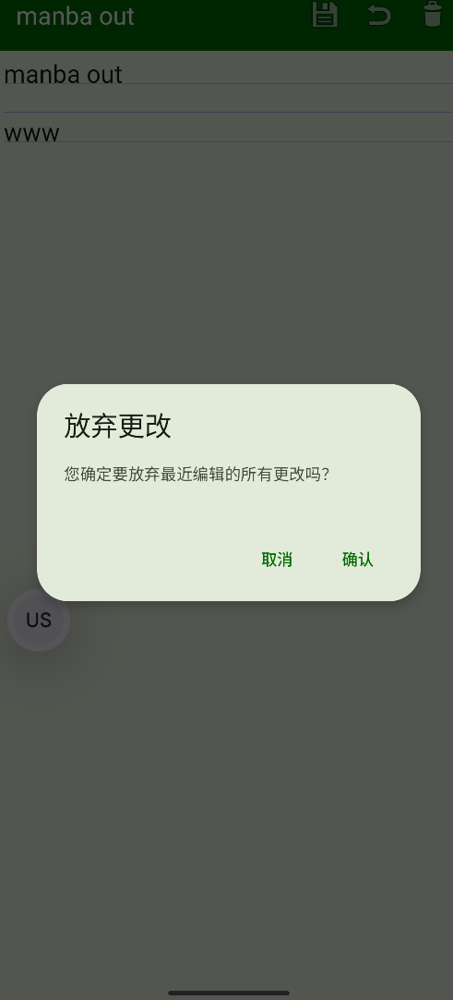

……所有的界面都应用该动态颜色的 Material 风格主题。

(5) 明暗模式 - 设为暗色模式

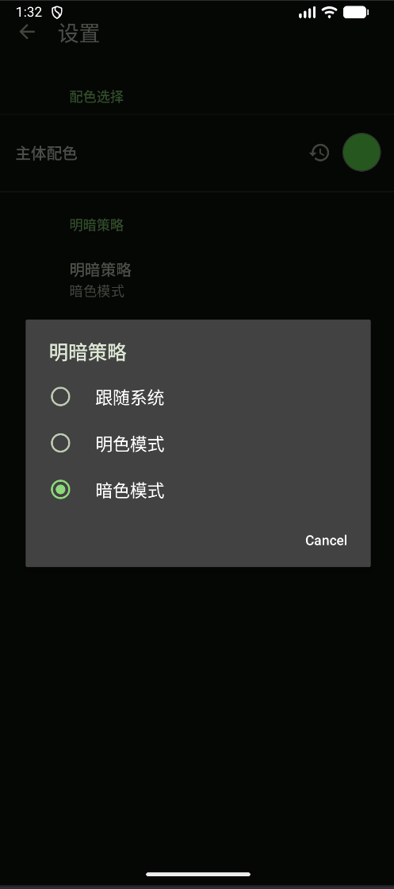

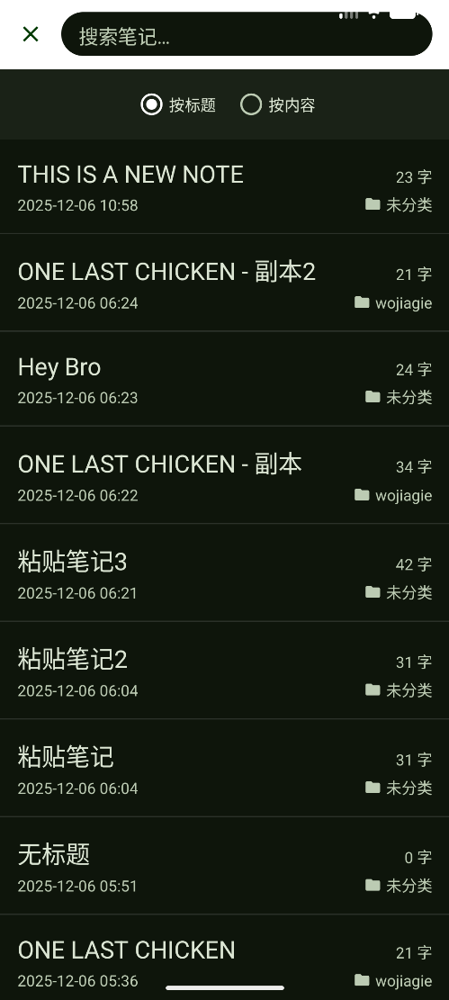

### （二）、 文件夹功能（笔记分类）

#### 1. 功能要求

为了解决笔记数量增多后难以管理的问题，项目引入了文件夹功能。用户可以将笔记分门别类地归入不同文件夹，实现笔记的结构化管理。该功能需要覆盖从文件夹创建、管理到笔记归类的完整流程。

#### 2. 实现思路和技术实现

该功能的核心在于数据库结构的扩展、ContentProvider 的升级以及新增多个 Activity 和 Adapter 来构建新的管理界面。

(1) 数据层设计与实现

- 数据库扩展: 在 NotePadProvider 的 DatabaseHelper 中，新增了一张 folders 表，用于存储文件夹信息（\_id, name, created, modified）。同时，在原有的 notes 表中增加了一个 folder_id 列，作为外键关联到 folders 表的 \_id。folder\_id 为 0 或 NULL 被定义为“未分类”笔记。

  ```java
  // 在 NotePadProvider.java 的 onCreate()方法中
  db.execSQL("CREATE TABLE " + NotePad.Notes.TABLE_NAME + " ("
             + NotePad.Notes._ID + " INTEGER PRIMARY KEY,"
             + NotePad.Notes.COLUMN_NAME_TITLE + " TEXT,"
             + NotePad.Notes.COLUMN_NAME_NOTE + " TEXT,"
             + NotePad.Notes.COLUMN_NAME_CREATE_DATE + " INTEGER,"
             + NotePad.Notes.COLUMN_NAME_MODIFICATION_DATE + " INTEGER,"
             + NotePad.Notes.COLUMN_NAME_FOLDER_ID + " INTEGER DEFAULT 0"
             + ");");
  db.execSQL("CREATE TABLE " + NotePad.Folders.TABLE_NAME + " ("
             + NotePad.Folders._ID + " INTEGER PRIMARY KEY,"
             + NotePad.Folders.COLUMN_NAME_NAME + " TEXT NOT NULL,"
             + NotePad.Folders.COLUMN_NAME_CREATE_DATE + " INTEGER,"
             + NotePad.Folders.COLUMN_NAME_MODIFICATION_DATE + " INTEGER"
             + ");");
  ```

- ContentProvider 升级 NotePadProvider 进行了大幅扩展，增加了处理 folders 表的 URI 匹配规则 (FOLDERS, FOLDER_ID)。其 query() 方法变得更为复杂，能够处理 LEFT JOIN 查询。例如，查询文件夹列表时，会左连接 notes 表并使用 GROUP BY 和 COUNT() 来实时计算每个文件夹内的笔记数量。

  ```java
  // 在 NotePadProvider.java 的 query() 方法中
  case FOLDERS:
                 String tables = NotePad.Folders.TABLE_NAME + " LEFT JOIN " + NotePad.Notes.TABLE_NAME +
                         " ON (" + NotePad.Folders.TABLE_NAME + "." + NotePad.Folders._ID + " = " +
                         NotePad.Notes.TABLE_NAME + "." + NotePad.Notes.COLUMN_NAME_FOLDER_ID + ")";
                 qb.setTables(tables);
                 qb.setProjectionMap(sFoldersProjectionMap);
                 groupBy = NotePad.Folders.TABLE_NAME + "." + NotePad.Folders._ID;
                 orderBy = TextUtils.isEmpty(sortOrder) ? NotePad.Folders.DEFAULT_SORT_ORDER : sortOrder;
                 break;
  ```

- 删除逻辑: NotePadProvider 的 delete() 方法中包含了关键的业务逻辑：当删除一个文件夹时，并不会直接删除其内部的笔记，而是先将这些笔记的 folder_id 更新为 0，使其回归到“未分类”状态，从而防止用户数据丢失。

  ```java
  // 在 NotePadProvider 的 delete() 方法中
  case FOLDERS:
      // 在删除文件夹时，将该文件夹下的所有笔记的 folder_id 设为 0 (未分类)
      // 这是一个重要的业务逻辑，防止笔记“丢失”
      ContentValues updateValues = new ContentValues();
      updateValues.put(NotePad.Notes.COLUMN_NAME_FOLDER_ID, 0);
      db.update(NotePad.Notes.TABLE_NAME, updateValues, NotePad.Notes.COLUMN_NAME_FOLDER_ID + " = " + uri.getPathSegments().get(NotePad.Folders.FOLDER_ID_PATH_POSITION), null);
  
      count = db.delete(NotePad.Folders.TABLE_NAME, where, whereArgs);
      break;
  
  case FOLDER_ID:
      String folderIdToDelete = uri.getPathSegments().get(NotePad.Folders.FOLDER_ID_PATH_POSITION);
  
      // 在删除文件夹时，将该文件夹下的所有笔记的 folder_id 设为 0 (未分类)
      ContentValues valuesToUpdateNotes = new ContentValues();
      valuesToUpdateNotes.put(NotePad.Notes.COLUMN_NAME_FOLDER_ID, 0);
      db.update(NotePad.Notes.TABLE_NAME, valuesToUpdateNotes,
                NotePad.Notes.COLUMN_NAME_FOLDER_ID + " = ?",
                new String[]{folderIdToDelete});
  
      finalWhere = NotePad.Folders._ID + " = " + folderIdToDelete;
      if (where != null) {
          finalWhere = finalWhere + " AND " + where;
      }
      count = db.delete(NotePad.Folders.TABLE_NAME, finalWhere, whereArgs);
  
      // 通知笔记列表可能需要刷新
      getContext().getContentResolver().notifyChange(NotePad.Notes.CONTENT_URI, null);
      break;
  ```

  

(2) 文件夹管理视图 (FolderActivity)

- UI 与数据加载: FolderActivity 作为文件夹的主管理界面，使用 RecyclerView 和 GridLayoutManager 以网格形式展示所有文件夹。它通过 LoaderManager 异步加载数据。

  FolderActivity.java 内添加 Loader ID 和成员变量：

  ```java
  private static final int FOLDER_LIST_LOADER_ID = 0;
  private static final int UNCLASSIFIED_NOTES_COUNT_LOADER_ID = 1;
  private FolderAdapter mAdapter;
  private TextView mFolderCountTextView;
  private TextView mSearchResultsCountTextView;
  private EditText mSearchEditText;
  ```
  在 onCreate() 方法中初始化 Loader 和 FAB，并设置搜索：

  ```java
  @Override
  protected void onCreate(Bundle savedInstanceState) {
      super.onCreate(savedInstanceState);
      setContentView(R.layout.activity_folder);
  
      Toolbar toolbar = findViewById(R.id.toolbar_folder);
      setSupportActionBar(toolbar);
      if (getSupportActionBar() != null) {
          getSupportActionBar().setDisplayHomeAsUpEnabled(true);
          getSupportActionBar().setDisplayShowTitleEnabled(false);
      }
      toolbar.setNavigationOnClickListener(v -> finish());
  
      RecyclerView recyclerView = findViewById(R.id.folders_recycler_view);
      mAdapter = new FolderAdapter();
      recyclerView.setAdapter(mAdapter);
      recyclerView.setLayoutManager(new GridLayoutManager(this, 3)); // 3列网格布局
  
      registerForContextMenu(recyclerView); // 为RecyclerView注册上下文菜单，以便长按弹出
  
      mFolderCountTextView = findViewById(R.id.folder_count);
      mSearchResultsCountTextView = findViewById(R.id.folder_search_results_count);
      mSearchEditText = findViewById(R.id.search_folders_edit_text);
  
      LoaderManager.getInstance(this).initLoader(FOLDER_LIST_LOADER_ID, null, this);
      LoaderManager.getInstance(this).initLoader(UNCLASSIFIED_NOTES_COUNT_LOADER_ID, null, this);
  
      FloatingActionButton fab = findViewById(R.id.fab_add_folder);
      fab.setOnClickListener(v -> showCreateFolderDialog()); // 点击FAB创建文件夹
  
      setupSearch();
  }
  ```

- 特殊的“未分类”文件夹: “未分类”文件夹并非数据库中的一个真实条目。它的实现技巧在于：
  
  1. FolderAdapter 的 getItemCount() 总是返回 cursor.getCount() + 1。
  
     ```java
     @Override
     public int getItemCount() {
         return (mCursor == null ? 0 : mCursor.getCount()) + 1;
     }
     ```
  
  2. 在 onBindViewHolder() 中，当 position == 0 时，强制绑定为“未分类”文件夹的数据和样式。
  
     ```java
     @Override
     public void onBindViewHolder(@NonNull FolderViewHolder holder, int position) {
         // 根据 position 绑定数据
         if (position == 0) {
             holder.bindUnclassified(); // 绑定“未分类”文件夹
         } else {
             if (mCursor == null) return;
             mCursor.moveToPosition(position - 1); // 真实的 cursor 的位置需要 -1
             holder.bind(mCursor);
         }
     }
     ```
  
  3. FolderActivity 使用第二个 CursorLoader 专门查询 folder_id 为 0 的笔记数量，并将此计数值传递给 FolderAdapter，用于显示在“未分类”文件夹的角标上。
  
     ```java
     case UNCLASSIFIED_NOTES_COUNT_LOADER_ID:
         // 查询 folder_id 为 0 或 NULL 的笔记
         String unclassifiedSelection = NotePad.Notes.COLUMN_NAME_FOLDER_ID + " = 0 OR " + NotePad.Notes.COLUMN_NAME_FOLDER_ID + " IS NULL";
         return new CursorLoader(this, NotePad.Notes.CONTENT_URI, new String[]{NotePad.Notes._ID}, unclassifiedSelection, null, null);
     ```
  
- 管理操作:
  - 创建: 通过界面右下角的 FloatingActionButton 触发，弹出一个 AlertDialog，用户输入名称后通过 ContentResolver 插入新文件夹。
  
    ```java
    private void showCreateFolderDialog() {
        AlertDialog.Builder builder = new AlertDialog.Builder(this);
        builder.setTitle("新建文件夹");
    
        final EditText input = new EditText(this);
        input.setInputType(InputType.TYPE_CLASS_TEXT);
        input.setHint("请输入文件夹名称");
        builder.setView(input);
    
        builder.setPositiveButton("确定", (dialog, which) -> {
            String folderName = input.getText().toString().trim();
            if (!folderName.isEmpty()) {
                createNewFolder(folderName);
            } else {
                Toast.makeText(this, "文件夹名称不能为空", Toast.LENGTH_SHORT).show();
            }
        });
        builder.setNegativeButton("取消", (dialog, which) -> dialog.cancel());
    
        builder.show();
    }
    ```
  
  - 重命名/删除: 通过长按文件夹项触发 ContextMenu。FolderActivity 捕获菜单项点击事件，同样使用 AlertDialog 来实现重命名和删除确认。
  
    ```java
    private void showRenameFolderDialog(long folderId, String currentName) {
        AlertDialog.Builder builder = new AlertDialog.Builder(this);
        builder.setTitle(R.string.menu_rename_folder);
    
        final EditText input = new EditText(this);
        input.setInputType(InputType.TYPE_CLASS_TEXT);
        input.setText(currentName);
        input.setSelection(currentName.length());
        // 限制不能输入换行符
        input.setFilters(new InputFilter[] { (source, start, end, dest, dstart, dend) -> {
            for (int i = start; i < end; i++) {
                if (source.charAt(i) == '\n') {
                    return "";
                }
            }
            return null;
        }});
        builder.setView(input);
    
        builder.setPositiveButton(R.string.dialog_ok, (dialog, which) -> {
            String newName = input.getText().toString().trim();
            if (!newName.isEmpty() && !newName.equals(currentName)) {
                ContentValues values = new ContentValues();
                values.put(NotePad.Folders.COLUMN_NAME_NAME, newName);
                Uri folderUri = ContentUris.withAppendedId(NotePad.Folders.CONTENT_URI, folderId);
                getContentResolver().update(folderUri, values, null, null);
            }
        });
        builder.setNegativeButton(R.string.dialog_cancel, (dialog, which) -> dialog.cancel());
        builder.show();
    }
    
    private void handleDeleteFolder(long folderId, int noteCount) {
        if (noteCount > 0) {
            // 有笔记，需要二次确认
            new AlertDialog.Builder(this)
                    .setTitle(R.string.delete_folder_dialog_title)
                    .setMessage(getString(R.string.delete_folder_dialog_message, noteCount))
                    .setPositiveButton(R.string.dialog_ok, (dialog, which) -> deleteFolder(folderId))
                    .setNegativeButton(R.string.dialog_cancel, null)
                    .show();
        } else {
            // 空文件夹，直接删除
            deleteFolder(folderId);
        }
    }
    
    private void deleteFolder(long folderId) {
        Uri folderUri = ContentUris.withAppendedId(NotePad.Folders.CONTENT_URI, folderId);
        getContentResolver().delete(folderUri, null, null);
        Toast.makeText(this, R.string.folder_deleted_toast, Toast.LENGTH_SHORT).show();
    }
    ```
  
  - 搜索: 实现了与主列表类似的搜索框，通过 TextWatcher 和 Handler 防抖，restartLoader 动态构建 WHERE name LIKE ? 查询条件来筛选文件夹。
  
    ```java
    private void setupSearch() {
        mSearchEditText.addTextChangedListener(new TextWatcher() {
            private final Handler handler = new Handler();
            private Runnable workRunnable;
    
            @Override
            public void beforeTextChanged(CharSequence s, int start, int count, int after) {}
            @Override
            public void onTextChanged(CharSequence s, int start, int before, int count) {}
            @Override
            public void afterTextChanged(Editable s) {
                handler.removeCallbacks(workRunnable);
                workRunnable = () -> performSearch(s.toString());
                handler.postDelayed(workRunnable, 300); // 延迟搜索
            }
        });
    }
    
    private void performSearch(String query) {
        Bundle args = new Bundle();
        args.putString("query", query);
        LoaderManager.getInstance(this).restartLoader(FOLDER_LIST_LOADER_ID, args, this);
    }
    ```

(3) 文件夹内部与笔记归类视图 (FolderNotesActivity & SelectNotesActivity)

- 文件夹内部视图: 点击任一文件夹会启动 FolderNotesActivity，并通过 Intent 传入 folder_id。该 Activity 同样使用 RecyclerView 和 NoteGridAdapter 展示笔记网格。其 CursorLoader 的查询条件是 WHERE folder_id = ?，确保只显示属于当前文件夹的笔记。

  ```java
  @Override
  protected void onCreate(Bundle savedInstanceState) {
      super.onCreate(savedInstanceState);
      setContentView(R.layout.activity_folder_notes);
  
      mFolderId = getIntent().getLongExtra(EXTRA_FOLDER_ID, -1);
      mFolderName = getIntent().getStringExtra(EXTRA_FOLDER_NAME);
  
      if (mFolderId == -1 || mFolderName == null) {
          finish(); // 如果没有有效的文件夹信息，则关闭 Activity
          return;
      }
  
      mFabAddNote = findViewById(R.id.fab_add_note_to_folder);
  
      mFabAddNote.setOnClickListener(v -> {
          Intent intent = new Intent(FolderNotesActivity.this, SelectNotesActivity.class);
          intent.putExtra(SelectNotesActivity.EXTRA_CURRENT_FOLDER_ID, mFolderId);
          startActivity(intent);
      });
  
      mToolbar = findViewById(R.id.toolbar_folder_notes);
      mToolbar.setTitle(mFolderName);
      setSupportActionBar(mToolbar);
      if (getSupportActionBar() != null) {
          getSupportActionBar().setDisplayHomeAsUpEnabled(true);
      }
      mToolbar.setNavigationOnClickListener(v -> finish());
  
      RecyclerView recyclerView = findViewById(R.id.folder_notes_recycler_view);
      mAdapter = new NoteGridAdapter(); // 我们需要创建一个 NoteGridAdapter
      recyclerView.setAdapter(mAdapter);
      recyclerView.setLayoutManager(new GridLayoutManager(this, 3));
  
      mSearchEditText = findViewById(R.id.search_folder_notes_edit_text);
      mSearchResultsCountTextView = findViewById(R.id.folder_notes_search_results_count);
  
      LoaderManager.getInstance(this).initLoader(NOTES_IN_FOLDER_LOADER_ID, null, this);
  
      setupSearch();
  }
  
  @NonNull
  @Override
  public Loader<Cursor> onCreateLoader(int id, @Nullable Bundle args) {
      String selection;
      String[] selectionArgs;
      // 基础查询条件：必须属于当前文件夹
      String baseSelection = NotePad.Notes.COLUMN_NAME_FOLDER_ID + " = ?";
  
      if (args != null && args.containsKey("query")) {
          String query = args.getString("query");
          if (query != null && !query.isEmpty()) {
              // 复合查询条件：属于当前文件夹 AND 标题匹配
              selection = baseSelection + " AND " + NotePad.Notes.COLUMN_NAME_TITLE + " LIKE ?";
              selectionArgs = new String[]{String.valueOf(mFolderId), "%" + query + "%"};
          } else {
              selection = baseSelection;
              selectionArgs = new String[]{String.valueOf(mFolderId)};
          }
      } else {
          selection = baseSelection;
          selectionArgs = new String[]{String.valueOf(mFolderId)};
      }
  
      return new CursorLoader(
          this,
          NotePad.Notes.CONTENT_URI,
          null, // 所有列
          selection,
          selectionArgs,
          NotePad.Notes.DEFAULT_SORT_ORDER
      );
  }
  ```

- 笔记归类: FolderNotesActivity 中的 + FAB 按钮启动 SelectNotesActivity，并传入当前 folder_id。
  - SelectNotesActivity 是一个多选界面，其 CursorLoader 精巧地设计为查询 WHERE folder_id != ? 的笔记，即只显示那些不在当前文件夹内的笔记供用户选择。
  
    ```java
    @Override
    protected void onCreate(Bundle savedInstanceState) {
        super.onCreate(savedInstanceState);
        setContentView(R.layout.activity_select_notes);
    
        mCurrentFolderId = getIntent().getLongExtra(EXTRA_CURRENT_FOLDER_ID, -1);
        if (mCurrentFolderId == -1) {
            finish(); // 无法确定目标文件夹，退出
            return;
        }
    
        mToolbar = findViewById(R.id.toolbar_select_notes);
        setSupportActionBar(mToolbar);
        if (getSupportActionBar() != null) {
            getSupportActionBar().setDisplayHomeAsUpEnabled(true);
        }
        mToolbar.setNavigationOnClickListener(v -> finish());
        mToolbar.setSubtitle(null); // 初始时没有副标题
    
        mSearchEditText = findViewById(R.id.search_select_notes_edit_text);
        mFabConfirm = findViewById(R.id.fab_confirm_selection);
    
        RecyclerView recyclerView = findViewById(R.id.select_notes_recycler_view);
        mAdapter = new SelectNotesAdapter(this);
        recyclerView.setAdapter(mAdapter);
        recyclerView.setLayoutManager(new LinearLayoutManager(this));
    
        LoaderManager.getInstance(this).initLoader(SELECT_NOTES_LOADER_ID, null, this);
    
        setupSearch();
        setupFab();
    }
    
    @NonNull
    @Override
    public Loader<Cursor> onCreateLoader(int id, @Nullable Bundle args) {
        // 查询条件：folder_id 不等于当前文件夹 ID (包括未分类的)
        // 未分类的 folder_id 是 0
        String selection = NotePad.Notes.COLUMN_NAME_FOLDER_ID + " != ?";
        String[] selectionArgs = new String[]{String.valueOf(mCurrentFolderId)};
    
        if (args != null && args.containsKey("query")) {
            String query = args.getString("query");
            if (query != null && !query.isEmpty()) {
                selection += " AND " + NotePad.Notes.COLUMN_NAME_TITLE + " LIKE ?";
                selectionArgs = new String[]{String.valueOf(mCurrentFolderId), "%" + query + "%"};
            }
        }
    
        return new CursorLoader(
            this,
            NotePad.Notes.CONTENT_URI,
            null,
            selection,
            selectionArgs,
            NotePad.Notes.DEFAULT_SORT_ORDER
        );
    }
    ```
  
  - SelectNotesAdapter 内部维护一个 `HashSet<Long>` 来存储选中笔记的 ID，并通过 itemView.setActivated(true/false) 和 selector drawable 提供即时的视觉反馈。
  
    ```java
    private final Set<Long> mSelectedNoteIds = new HashSet<>();
    
    // ...
    
    class NoteViewHolder extends RecyclerView.ViewHolder {
        TextView noteTitle;
    
        public NoteViewHolder(@NonNull View itemView) {
            super(itemView);
            noteTitle = itemView.findViewById(android.R.id.text1);
        }
    
        public void bind(Cursor cursor) {
            final long noteId = cursor.getLong(mIdColumnIndex);
            noteTitle.setText(cursor.getString(mTitleColumnIndex));
    
            // 更新选中状态的视觉效果
            itemView.setActivated(mSelectedNoteIds.contains(noteId));
    
            itemView.setOnClickListener(v -> {
                if (mSelectedNoteIds.contains(noteId)) {
                    mSelectedNoteIds.remove(noteId);
                } else {
                    mSelectedNoteIds.add(noteId);
                }
                // 更新视觉效果并通知 Activity
                itemView.setActivated(mSelectedNoteIds.contains(noteId));
                if (mListener != null) {
                    mListener.onSelectionChanged(mSelectedNoteIds.size());
                }
            });
        }
    }
    ```
  
  - 当用户点击确认按钮后，SelectNotesActivity 会构建一个 WHERE _id IN (?,?,...) 子句，通过一次 ContentResolver.update() 批量更新所有选中笔记的 folder_id，高效地完成了笔记的归类操作。
  
    ```java
    private void addSelectedNotesToFolder() {
        Set<Long> selectedIds = mAdapter.getSelectedNoteIds();
        if (selectedIds.isEmpty()) return;
    
        // 构建 WHERE 子句: _id IN (?, ?, ...)
        StringBuilder whereClause = new StringBuilder(NotePad.Notes._ID + " IN (");
        String[] whereArgs = new String[selectedIds.size()];
        int i = 0;
        for (Long id : selectedIds) {
            whereClause.append("?");
            if (i < selectedIds.size() - 1) {
                whereClause.append(",");
            }
            whereArgs[i++] = String.valueOf(id);
        }
        whereClause.append(")");
    
        ContentValues values = new ContentValues();
        values.put(NotePad.Notes.COLUMN_NAME_FOLDER_ID, mCurrentFolderId);
    
        // 批量更新
        int updatedRows = getContentResolver().update(
                NotePad.Notes.CONTENT_URI,
                values,
                whereClause.toString(),
                whereArgs
        );
    
        if (updatedRows > 0) {
            Toast.makeText(this, R.string.notes_added_successfully, Toast.LENGTH_SHORT).show();
        }
        finish(); // 完成后关闭界面
    }
    ```

#### 3. 实现效果界面截图

(1) 文件夹管理主视图（包含“未分类”）

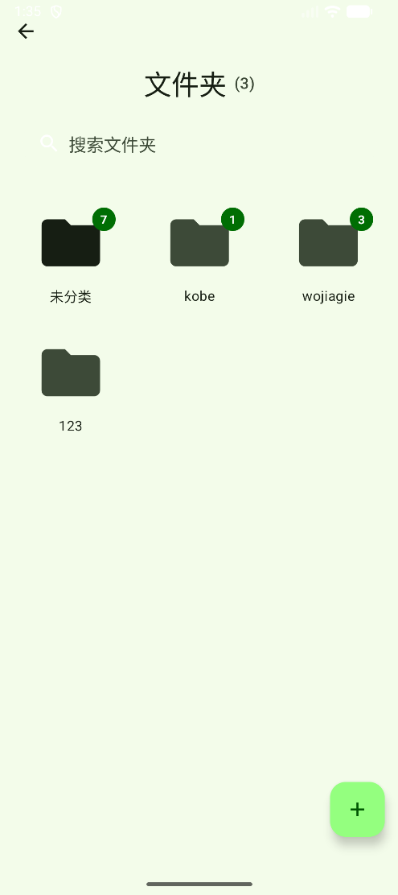

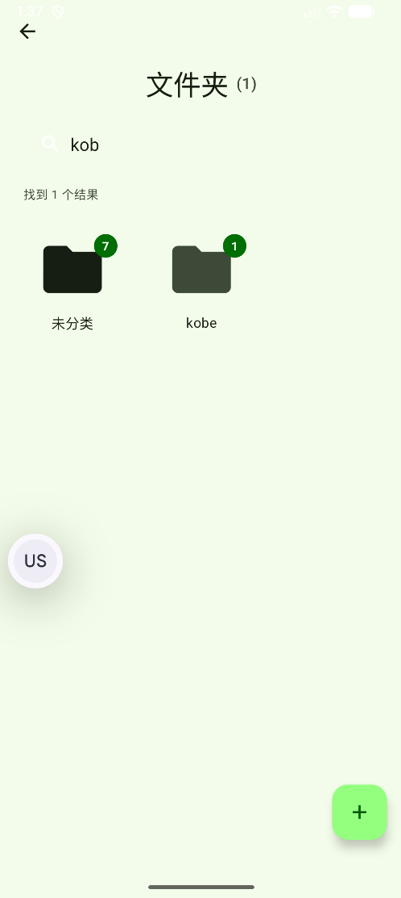

(2) 创建新文件夹与长按上下文菜单

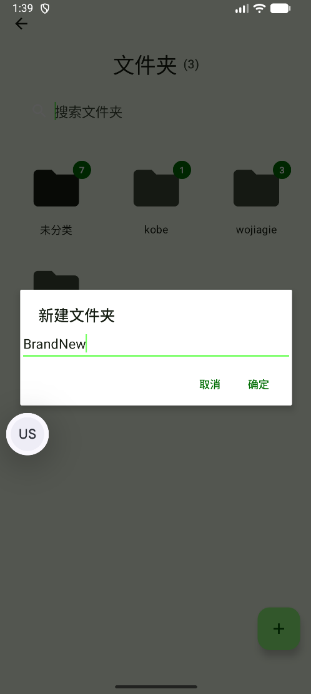

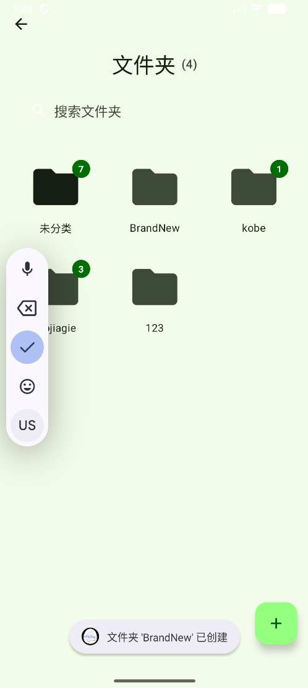

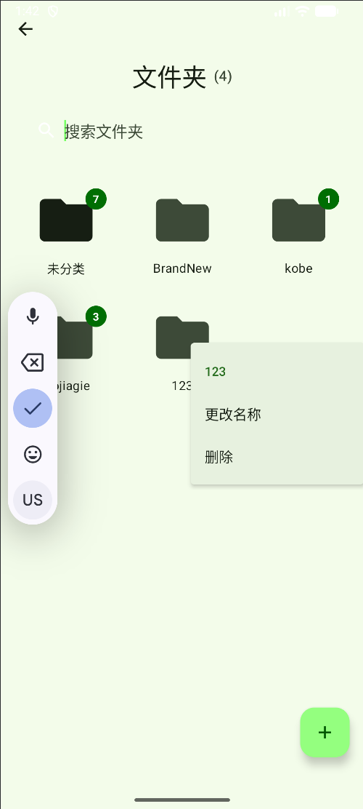

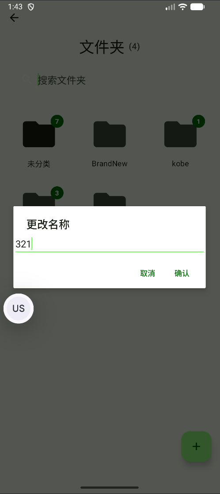

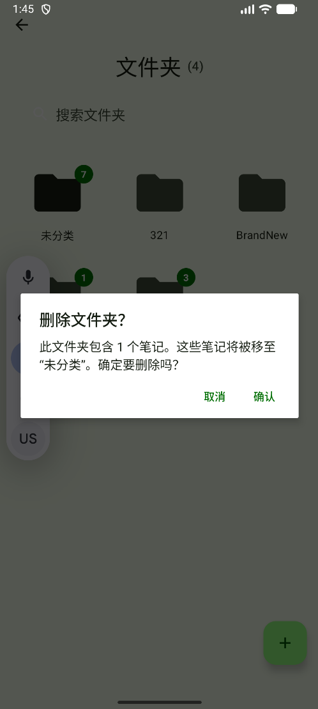

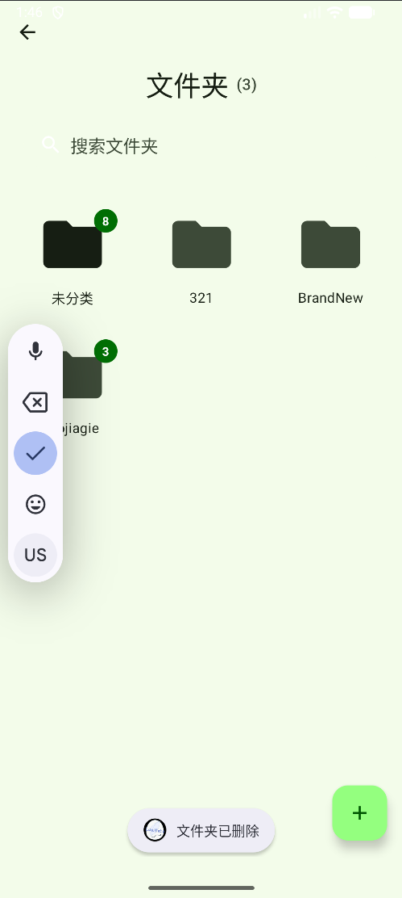

(3) 文件夹内部笔记视图 

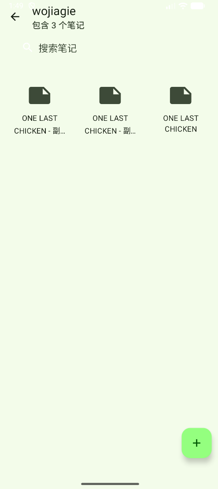

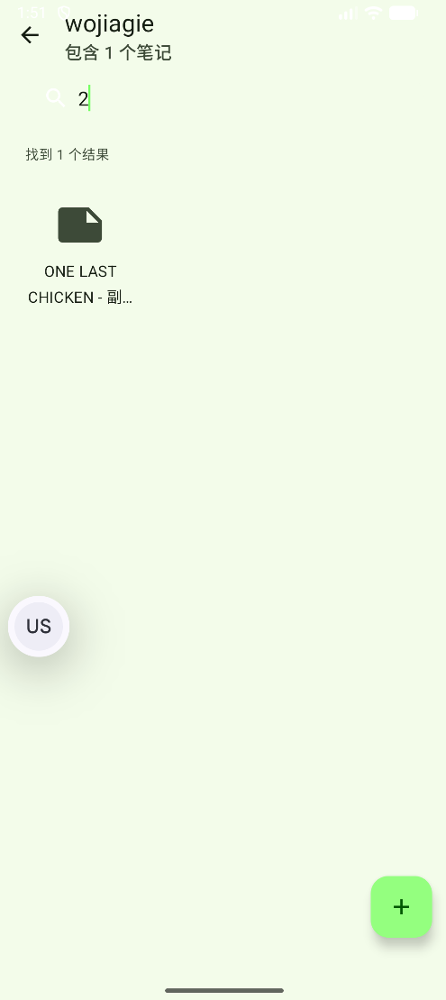

(4) 笔记归类时的多选界面

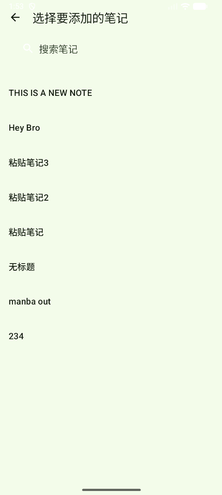

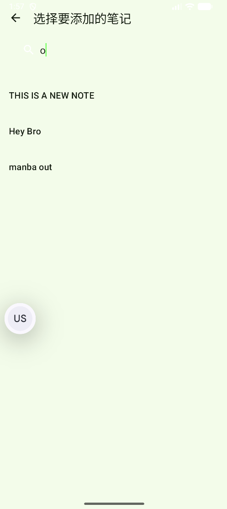

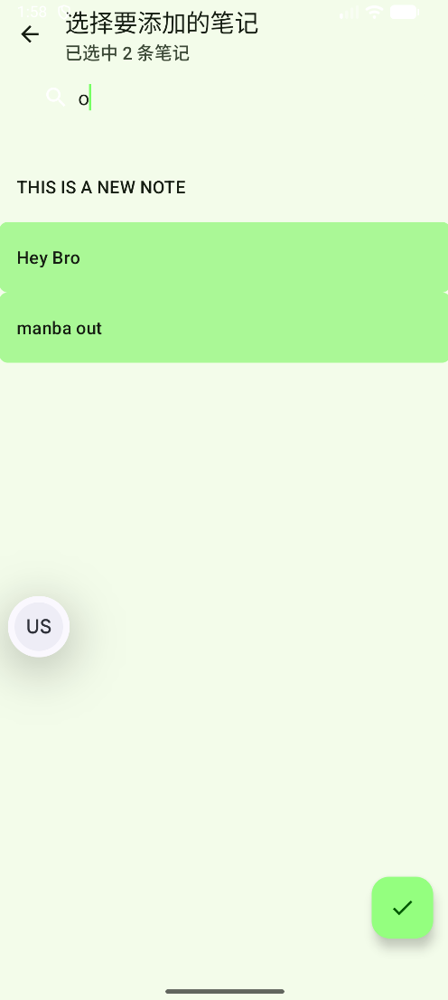

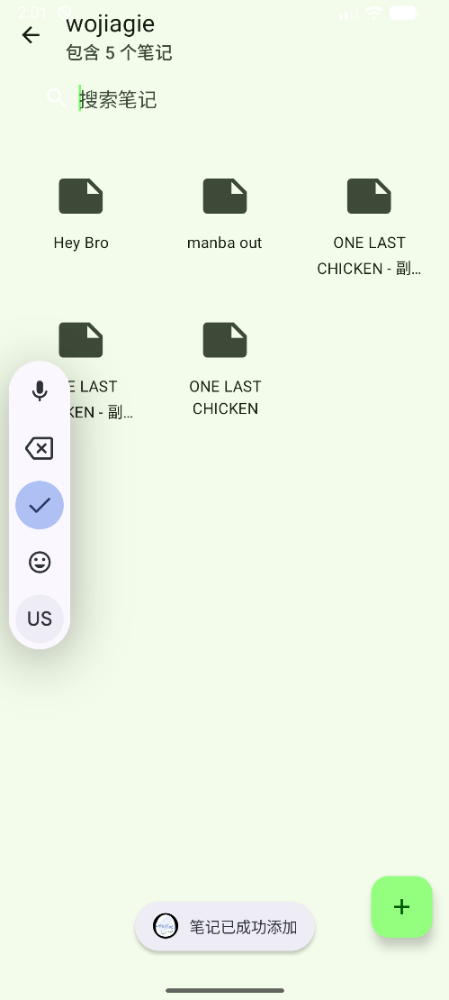

